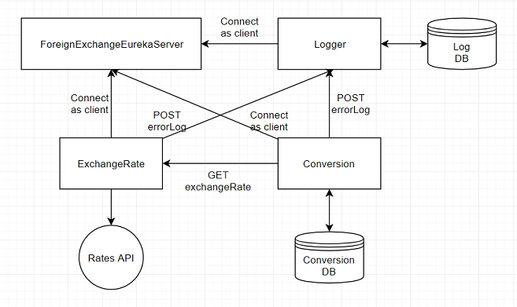

# Foreign Exchange Project
This project contains 3 client and a discovery server. These are:

  - foreignexchangeeurekaserver
  - exchangerate
  - conversion
  - logger



## ForeignExchangeEurekaServer
This is the eureka discovery server. Other services connect to this server as eureka clients. 

### Application Properties
| Name | Value |
| ------ | ------ |
| spring.application.name | foreign-exchange-eureka-server |
| server.port | `9999` |
| eureka.instance.hostname | `localhost` |
| eureka.client.registerWithEureka | false |
| eureka.client.fetchRegistry | false |

### Running
To run this project from command line;
```sh
cd foreignexchangeeurekaserver && mvn spring-boot:run
```

After the project is up and running, the discovery server will be listening client registration requests from http://localhost:9999/eureka

## ExchangeRate
This is the exchange rate api. It uses https://api.ratesapi.io/api/ to get results with given inputs.

### Application Properties
| Name | Value |
| ------ | ------ |
| spring.application.name | exchange-rate |
| server.port | `8081` |
| eureka.client.serviceUrl.defaultZone | `http://localhost:9999/eureka` |
| eureka.client.fetch-registry | true |

To run this project from command line;
```sh
cd exchangerate && mvn spring-boot:run
```

### API Documentation
After the project is up and running, you can access swagger api documentation from http://localhost:8081/swagger-ui.html

## Conversion
This is the conversion api. It uses exchange rate api to get results with given inputs. And uses H2 in-memory database.

### Application Properties
| Name | Value |
| ------ | ------ |
| spring.application.name | conversion |
| server.port | `8082` |
| eureka.client.serviceUrl.defaultZone | `http://localhost:9999/eureka` |
| eureka.client.fetch-registry | true |
|spring.datasource.url | jdbc:h2:mem:test |
|spring.datasource.driverClassName | org.h2.Driver |
|spring.datasource.username | sa |
|spring.datasource.password |  |
|spring.jpa.database-platform | org.hibernate.dialect.H2Dialect |
|spring.h2.console.enabled | true |
|spring.h2.console.path | /h2 |

To run this project from command line;
```sh
cd conversion && mvn spring-boot:run
```

### API Documentation
After the project is up and running, you can access swagger api documentation from http://localhost:8082/swagger-ui.html

## Logger
This is the logger api. It serves as a centralized logging api. And uses H2 in-memory database.

### Application Properties
| Name | Value |
| ------ | ------ |
| spring.application.name | logger |
| server.port | `8083` |
| eureka.client.serviceUrl.defaultZone | `http://localhost:9999/eureka` |
| eureka.client.fetch-registry | true |
|spring.datasource.url | jdbc:h2:mem:test |
|spring.datasource.driverClassName | org.h2.Driver |
|spring.datasource.username | sa |
|spring.datasource.password |  |
|spring.jpa.database-platform | org.hibernate.dialect.H2Dialect |
|spring.h2.console.enabled | true |
|spring.h2.console.path | /h2 |

To run this project from command line;
```sh
cd logger && mvn spring-boot:run
```

### API Documentation
After the project is up and running, you can access swagger api documentation from http://localhost:8083/swagger-ui.html